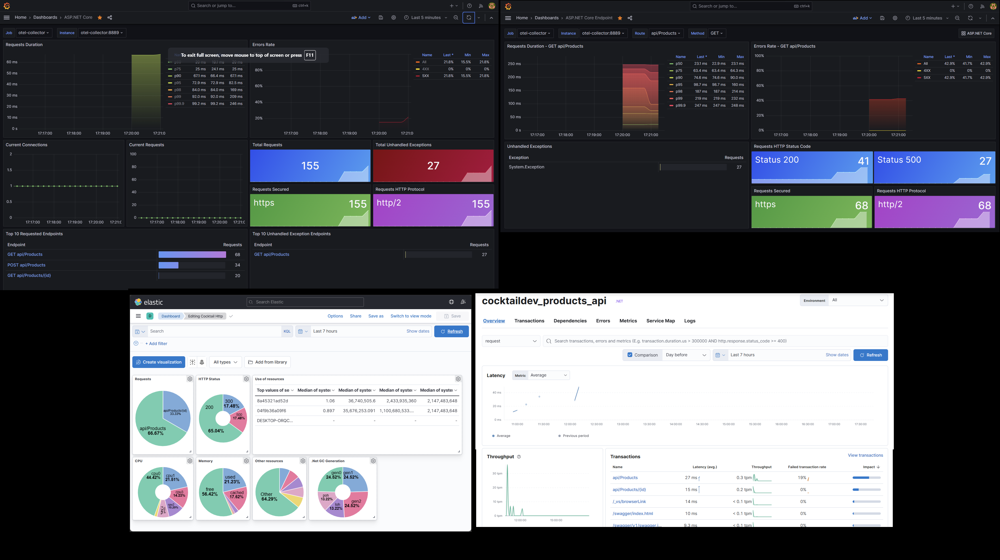

# CocktailDev

A cocktail or bunch of technologies to learn everything related to Microservices, Modernization, etc.

Always with the same model in mind:

- Products -> SQL Server
- Orders -> PostgreSQL
- Basket -> Redis
- Users (or Customers) -> SQL Server

# Infrastructure

- GitHub
- SQL Server
- Redis
- PostgreSQL
- RabitMQ / Azure Service Bus
- EventStore ?

# UI

- Angular
- Blazor

# Others

- API Gateway / BFF
- Docker
- Kubernetes

# CI /CD

- Azure DevOps / Git Actions

API Rest and Grpc build under Microsoft DotNet 7.x, 8.x and Upper

Much more...

# How to run

1. Create a folder C:\data\cocktaildev
2. COPY deploy\otel\otel-collector-config.yaml to C:\data\otel\otel-collector-config.yaml
3. run `docker-compose -p cocktaildev up -d`

# Observavility

